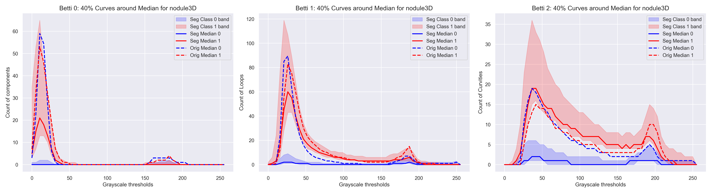
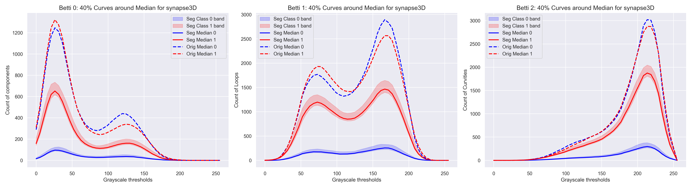
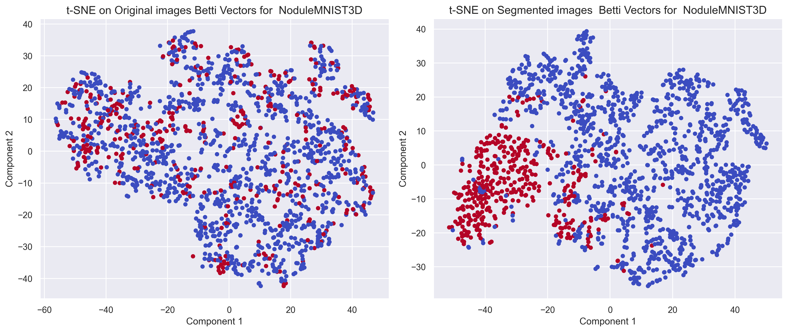
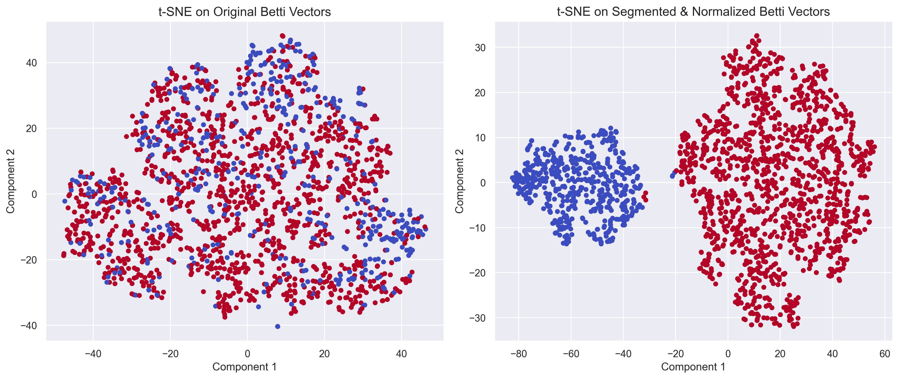

# TopoCAM_2025


#  TopoCAM: ROI-Driven Topological Signatures in Medical Imaging

TopoCAM is a modular framework that combines explainable deep learning with topological data analysis (TDA) for interpretable and robust medical image classification. It supports both **3D volumetric scans** and **2D grayscale images**, and has been validated across multiple MedMNIST and BraTS benchmarks.

---

##  Motivation

Deep learning models often struggle with interpretability and robustness in clinical settings, especially under limited supervision. TopoCAM addresses this by:

- Localizing class-discriminative regions using **multi-scale Grad-CAM**
- Segmenting the input image/volume based on fused attention maps
- Computing **Betti curves** via cubical persistent homology
- Classifying topological descriptors using a lightweight MLP

This approach filters out irrelevant anatomy and concentrates analysis on clinically meaningful structures.

---

##  Pipeline Overview

We define the pipeline as $\hat{y} = g_\psi \circ \phi \circ A_{w,\tau} \circ f_\theta(\mathbf{X})$.


Where:
- `f_θ`: Pretrained CNN backbone (ResNet-18 for 2D, R3D-18 for 3D)
- `A_{w,τ}`: Weighted Grad-CAM fusion and thresholding
- `φ`: Betti curve computation from segmented input
- `g_ψ`: MLP classifier trained on topological features

###  Full Pipeline Visualization

> The figure below illustrates the complete TopoCAM workflow applied to 3D brain MRI scans. It shows input slices, feature extraction via 3D ResNet-18, binary segmentation, and downstream analysis using topological descriptors.


---

## Datasets

Experiments are conducted on:

- **3D**: NoduleMNIST3D, FractureMNIST3D, SynapseMNIST3D, BraTS 2019/2021, Harvard OCT
- **2D**: BreastMNIST, PneumoniaMNIST

All inputs are resized to standardized shapes (e.g., 64×64×64 for 3D, 224×224 for 2D), and grayscale images are replicated to 3 channels for compatibility with pretrained CNNs.

---

##  Performance Highlights: TopoCAM vs CNN/ViT Baselines

TopoCAM consistently delivers superior diagnostic performance across diverse medical imaging tasks, especially in 3D volumes where traditional models often struggle with irrelevant anatomy and limited supervision.

###  3D Medical Imaging Benchmarks

| Dataset             | Modality        | TopoCAM AUC | TopoCAM Accuracy |
|---------------------|------------------|-------------|------------------|
| FractureMNIST3D     | CT (bone)        | 99.6        | 98.1             |
| BraTS 2019          | MRI (brain)      | 94.2        | 98.5             |
| Harvard OCT         | OCT (retina)     | 78.4        | 81.4             |
| VesselMNIST3D       | MRA (vasculature)| 98.9        | 97.1             |
| SynapseMNIST3D      | EM (synapses)    | 98.4        | 81.0             |
| NoduleMNIST3D       | CT (lung nodules)| 99.6        | 98.1             |
| AdrenalMNIST3D      | CT (adrenal)     | 95.4        | 91.6             |
| BraTS 2021          | MRI (brain)      | 64.7        | 58.9             |

###  2D Medical Imaging Benchmarks

| Dataset           | Modality         | TopoCAM AUC | TopoCAM Accuracy |
|------------------|------------------|-------------|------------------|
| BreastMNIST      | Ultrasound       | 99.9        | 98.7             |
| PneumoniaMNIST   | Chest X-Ray      | 100.0       | 99.4             |
---

##  Interpretability via Topology

TopoCAM improves interpretability by focusing on class-relevant regions and summarizing their geometric complexity. The following figures illustrate this:

### Figure 5: Betti Curves from Original vs. Segmented Volumes

> ROI-based Betti curves show reduced variance and clearer class separation compared to full-volume topology.




---

### Figure 6: t-SNE Visualization of Betti Vectors

> Topological descriptors from segmented regions yield tighter clustering and better class separability.




---

##  Implementation Notes

- CNN backbones: `resnet18` (2D), `r3d_18` (3D), pretrained on ImageNet/Kinetics-400
- Grad-CAM fusion weights are optimized via **differential evolution** to maximize AUC
- Topological features are computed using **Giotto-TDA**
- MLP classifiers are shallow and efficient, trained with cross-entropy loss

---

##  Folder Structure
TopoCAM/

├── 2D_Model.py

├── 3D_Model.py

├── Nodule_betti_comparison_all_three.png

├── TopoCAM_3.png

├── nodule_tsne_comparison_plot.png

├── synapse_betti_comparison_all_three.png

├── synapse_tsne_comparison_plot.png

├── README.md

## Model Scripts

This repository includes two standalone scripts for running the TopoCAM pipeline on 2D and 3D medical imaging datasets. Each script is modular and can be adapted to new datasets by modifying the input paths and configuration parameters.

---

### `2D_Model.py`

Implements the full TopoCAM pipeline for 2D grayscale medical images such as **BreastMNIST** and **PneumoniaMNIST**.

**Key components:**
- Pretrained ResNet-18 backbone for feature extraction
- Multi-layer Grad-CAM attention maps from `layer2`, `layer3`, and `layer4`
- Weighted fusion of attention maps optimized via AUC
- ROI masking and Betti curve computation using cubical persistence
- Lightweight MLP classifier trained on topological descriptors

**Usage:**
```bash
python 2D_Model.py
```

### `3D_Model.py`

Implements the full TopoCAM pipeline for 3D volumetric scans.

**Key components:**
- Pretrained R3D-18 backbone for volumetric feature encoding
- Multi-layer Grad-CAM attention maps from `layer2`, `layer3`, and `layer4`
- Weighted fusion of attention maps optimized via AUC
- ROI segmentation via thresholded attention maps
- Betti vector extraction from segmented volumes using cubical persistence
- Lightweight MLP classifier trained on topological descriptors

**Usage:**
```bash
python 3D_Model.py
```
